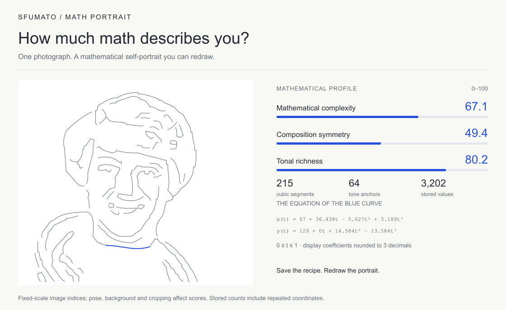

# Sfumato

**How much math describes you?**

Turn an image into a mathematical portrait. It fits Bézier curves to brightness boundaries, then reconstructs tone from those curves. You get an image, editable vector lines, and a recipe that can redraw the portrait without the original photograph.

Each image gets a mathematical profile: complexity, composition symmetry and tonal richness, scored from 0–100. The portrait card pairs these indices with the actual curves, stored-value counts and a real equation. [Scoring model](docs/SCORING.md)




No image AI, API keys, accounts, or photo uploads. The JavaScript package has **zero runtime dependencies** and works in Node.js and browsers.

[中文](README.zh-CN.md) · [Package API](packages/sfumato/README.md) · [How it works](docs/CONSTRUCTION.md) · [Release notes / 版本说明](docs/RELEASE.md)

## The package

```js
import { createPortrait, redraw } from '@shen-chenyu/sfumato';

const portrait = createPortrait({ data, width, height }); // decoded RGBA pixels

portrait.image;        // reconstructed portrait, 160×160 RGBA
portrait.svg;          // editable curve drawing
portrait.explanation;  // what was actually constructed
portrait.recipe;       // save as JSON; no source photograph inside
portrait.math;         // counts, an example equation and math.scores
portrait.card;         // mathematical self-portrait as a standalone SVG

const restored = redraw(portrait.recipe);
```

Use fewer boundary chains, change the fitting tolerance, or edit a curve and solve the tone again. The interest is in seeing an image emerge from a construction you can inspect and change.

The package is not published to npm. Build a local archive from this repository with Node 22:

```sh
git clone https://github.com/shen-chenyu/sfumato.git
cd sfumato
npm run package:pack
# Install shen-chenyu-sfumato-0.1.0.tgz in another project.
```

Building the package does not require installing the website dependencies. The archive contains the standalone engine, API, types and license.

## Try it on an image file

The core accepts pixels; this complete Node example uses Sharp to read a photo and save PNG:

```sh
npm run package:build
cd examples/node
npm install
node portrait.mjs ../../public/portrait.png output
```

It writes `portrait.png`, `curves.svg`, `recipe.json`, `explanation.txt`, `math.json`, and a mathematical self-portrait card as SVG and PNG. See the [API guide](packages/sfumato/README.md) for browser canvas usage and editable recipes.

## The browser demo

```sh
npm ci
npm run dev
```

Choose English or Chinese, upload an image, and save a mathematical self-portrait card as PNG or SVG. Expand the editor to inspect actual equations and edit control points. Recipe JSON imports and exports are compatible with the package. `/` and `/construct/` open the construction workspace; `/strokes/` contains an earlier stroke-selection study. Everything runs locally in your browser.

```sh
npm test          # engine and package checks
npm run typecheck
npm run lint
npm run build     # static demo in dist/client
```

## Model limits

This draws image boundaries; it does not understand facial anatomy or recover true 3D shape. Tone is solved on a 160×160 grid. Enlarging the result does not add detail, and the curve-only SVG differs from the tonal image. One boundary can require multiple cubic segments. The [mathematical notes](docs/CONSTRUCTION.md) explain the method and its measurements.

An optional [surface research experiment](research/surface/README.md) is retained separately and is not part of the package or required to use it.

MIT licensed. The example is a public-domain NASA photograph; see [credits](CREDITS.md). Contributions to the algorithm and rendering are welcome. See [contributing](CONTRIBUTING.md) and [privacy](PRIVACY.md).

The npm package and hosted demo have not been released. A manual GitHub Pages workflow is included for a future release or your own copy; pushing code does not deploy the site.
