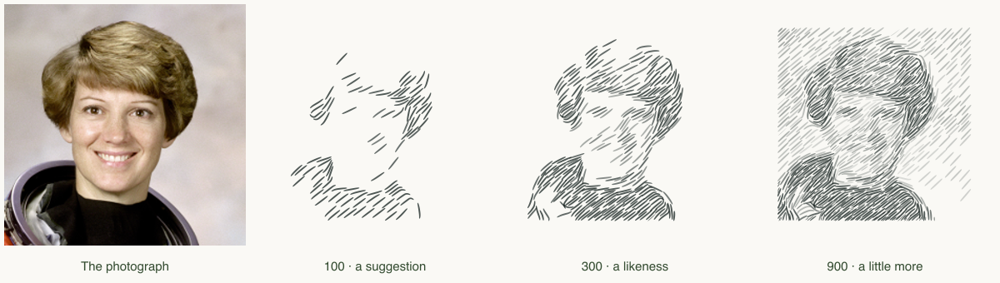

# Sfumato

**How few marks can say enough?**

A small drawing playground: bring a photograph, watch a mathematical search choose its strokes, and stop when you think it is enough. No image generation models, API keys, accounts, or photo uploads.

[Play in your browser](https://shen-chenyu.github.io/sfumato/) · [中文说明](README.zh-CN.md) · [The mathematics](docs/ALGORITHM.md)



## Things to try

- **The 100-stroke challenge.** Can you recognise the person before the face is fully drawn?
- **Find your “enough”.** Pause, scrub backwards, choose a stopping point. More marks are not always more expressive. Bookmark it with “This is the moment.”
- **Give it a different hand.** Try graphite, narrow etching, or soft ink on the same image.
- **Break its judgment.** Compare greedy selection with a seeded random ordering. Random marks must still improve the drawing objective.
- **Move its attention.** Click a detail to give it more weight. Keyboard users can focus the canvas and use arrow keys, then Enter.
- **Keep the drawing and the reasoning.** Export a 2000px PNG, editable SVG, or JSON recipe with selected curves and per-stroke error reductions.

Try a close portrait with clear side lighting first. Small faces and busy backgrounds are harder. The bundled subject is a cropped public-domain NASA photograph of Eileen Collins.

## Run locally

Node.js **22.13 or newer** is required; Node 22 is used in CI.

```sh
npm ci
npm run dev
```

Open the local address printed in your terminal. Choose a photograph or drag one onto the page. After the page loads, computation happens entirely on your device, in a Web Worker.

```sh
npm test          # numerical and determinism checks
npm run typecheck
npm run build     # static output in dist/client
npm start         # serve that output on localhost:4173
```

## What is actually mathematical?

The engine estimates local image structure, constructs thousands of tapered curves, and chooses useful marks through a positive, sparse greedy search. Every mark has a measurable benefit and a small complexity cost. A two-scale objective balances local edges with broad tone. See [the algorithm](docs/ALGORITHM.md) for the equations and [engine.mjs](public/engine.mjs) for the dependency-free implementation.

This is a drawing experiment, not a reconstruction of Leonardo's artistic judgment. It does not understand facial anatomy, estimate lighting in 3D, or invent missing details. The percentage in the interface is a drawing-error reduction, **not a beauty or identity score**. Screen and SVG rendering approximate the numerical stroke masks.

The browser version is intentionally a small standalone engine. Unlike the earlier Python research prototype, it uses no face landmarks and performs no coefficient refitting or stroke deletion; this lets every intermediate drawing replay as a simple growing sequence.

## Fork it and let others play

The included GitHub Pages workflow builds the static site and sets the repository subpath automatically. In your fork, go to **Settings → Pages → Build and deployment → Source: GitHub Actions**, then run the **Pages** workflow. No secrets or backend are needed. Update the project links for your fork.

For a custom static host, upload `dist/client` after `npm run build`. For a subdirectory host, build with `BASE_PATH=/your-path`. The `.openai/hosting.json` file identifies the original author's separate Sites preview; it is not needed for local development or GitHub Pages. Do not reuse its project ID for your own Sites deployment.

## Make it yours

- Change `buildCandidates` to invent new drawing gestures.
- Change `analyze` to experiment with attention and tone.
- Add a new objective or compare selection strategies.
- Share an image with its recipe, and explain what surprised you.

Please read [CONTRIBUTING](CONTRIBUTING.md), [privacy](PRIVACY.md), and [credits](CREDITS.md). Code is MIT licensed. Example imagery has its own public-domain attribution. No private photographs are included.
