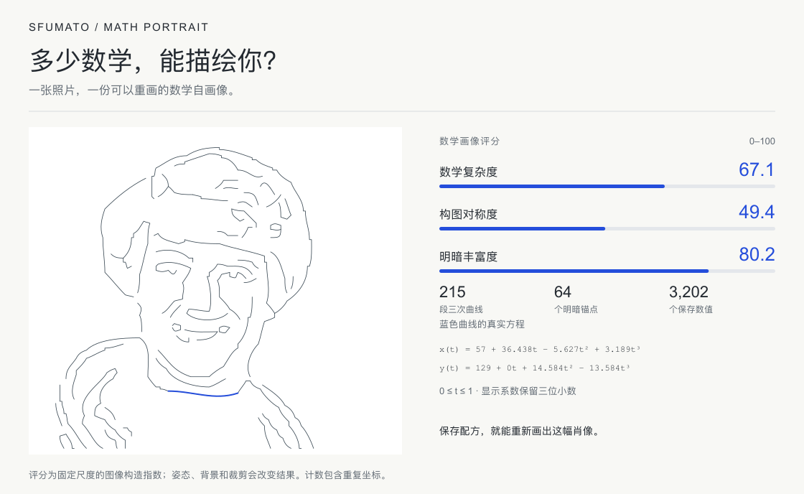
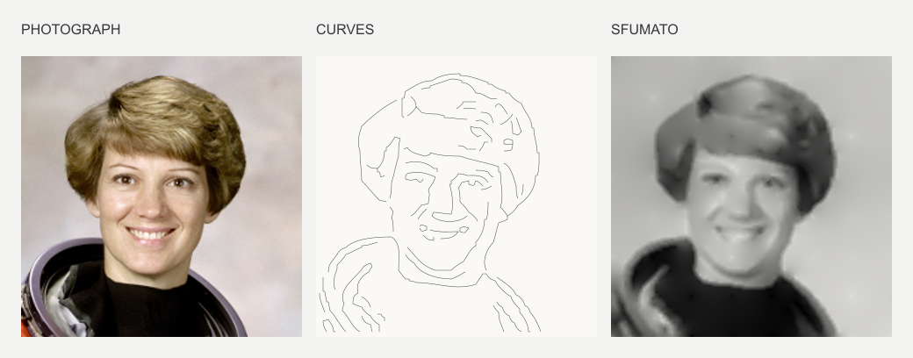

# Sfumato

**多少数学，能描绘你？**

输入图片，得到重建肖像、可编辑的曲线 SVG，以及不需要原照片就能重新画图的数学配方。算法用三次 Bézier 曲线拟合明暗边界，再从曲线两侧的采样求解明暗。

每张照片还会得到一份“数学画像评分”：数学复杂度、构图对称度、明暗丰富度，采用 0–100 固定尺度。卡片把评分与真实曲线、数值统计和一段具体方程放在一起。所有指标从配方计算。[评分模型与公式](docs/SCORING.md)





无图像生成 AI、API key、账号或图片上传。独立 JavaScript 包**没有运行时依赖**，可以在 Node.js 和浏览器中使用。

[English](README.md) · [包接口](packages/sfumato/README.zh-CN.md) · [算法原理](docs/CONSTRUCTION.zh-CN.md)

## 使用包

```js
import { createPortrait, redraw } from '@shen-chenyu/sfumato';

const portrait = createPortrait({ data, width, height }, {
  language: 'zh-CN',
});

portrait.image;        // 160×160 RGBA 肖像
portrait.svg;          // 可编辑的曲线图
portrait.explanation;  // 来自实际计算的简短解释
portrait.recipe;       // 可保存为 JSON，无原照片像素
portrait.math;         // 曲线数量、真实方程和 math.scores 三项评分
portrait.card;         // 可保存的数学自画像 SVG 卡片

const restored = redraw(portrait.recipe);
```

可以调整曲线数量和拟合精度，也可以改动控制点后重新生成图像。有意思的是：一张图真的由这些曲线和约束构成，而你可以拆开、修改、重画它。

目前没有发布到 npm。使用 Node 22，在仓库根目录生成本地安装包：

```sh
git clone https://github.com/shen-chenyu/sfumato.git
cd sfumato
npm run package:pack
```

生成 `shen-chenyu-sfumato-0.1.0.tgz`，可在其他项目中用 `npm install /路径/该文件.tgz` 安装。打包本身无需安装网页依赖。

## 用自己的图片试试

核心包接收解码后的 RGBA 像素。完整 Node 示例使用 Sharp 读取图片、保存 PNG：

```sh
npm run package:build
cd examples/node
npm install
node portrait.mjs ../../public/portrait.png output
```

输出肖像 PNG、曲线 SVG、配方 JSON、解释文本、数学统计，以及 SVG/PNG 数学自画像卡片。浏览器 canvas 用法见[接口说明](packages/sfumato/README.zh-CN.md)。

## 本地网页

```sh
npm ci
npm run dev
```

首页可以上传图片、查看曲线方程、调整控制点和导出结果。`/construct/` 是同一工作区的入口，`/strokes/` 保留笔触选择实验。

目前构造的是二维明暗边界，不识别解剖结构。明暗求解分辨率为 160×160，放大输出不会增加细节；SVG 是曲线图，PNG 才包含重建明暗。算法与数值记录见[说明](docs/CONSTRUCTION.zh-CN.md)。

[连续曲面研究](research/surface/README.md) 单独保留，不属于包的使用流程。示例使用 NASA 公开领域照片，授权见 [CREDITS](CREDITS.md)。代码采用 MIT 许可证。

首页支持中英文切换，可直接保存数学自画像 PNG / SVG 卡片。展开编辑区后可修改控制点、撤销和恢复构造；网页与 package 可以互相导入配方。Node 文件示例的最后一个可选参数为语言，例如：

```sh
node portrait.mjs ../../public/portrait.png output zh-CN
```

[版本说明（中英双语）](docs/RELEASE.md)。尚未发布 npm 包或托管演示；Pages 工作流仅手动触发，推送代码不会自动部署网站。
