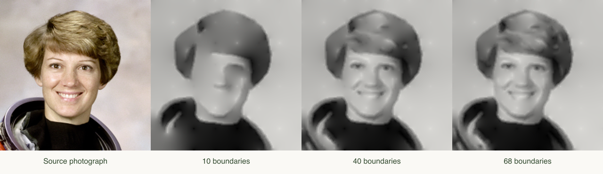

# Explicit curves and harmonic tone

This is the second local experiment. Its success criterion is deliberately concrete: a serialized construction must redraw without the source photograph, and editing that construction must change the reconstructed image.



## What the representation contains

- Connected image-brightness boundaries, each fitted with one or more cubic Bézier segments.
- Four 2D control points per segment. These give explicit polynomial coefficients for x(t) and y(t).
- Three grayscale values on each side of every segment. The two sides are sampled 1.65 analysis pixels away from the curve; values are interpolated along it.
- A regular 8 × 8 grid of grayscale anchors. Their locations and values are stored explicitly.

There is no original image, texture map, generated image or cached dense reconstruction in the recipe. The 64 anchors are genuine image information and are counted; they are not an unreported background layer. Geometry and tone are both necessary to reconstruct the picture. The construction is two-dimensional and does not recover anatomy, material, depth or physical illumination.

## Extraction and fitting

The source is composited on white, fitted to a 160 × 160 square and smoothed. Central-difference gradients, interpolated nonmaximum suppression and hysteresis produce candidate edges. An 8-neighbor graph is traced into chains, avoiding redundant diagonal connections around orthogonal corners. Short chains are discarded. Chains are ranked by length, mean contrast and a broad center attention weight. This is a heuristic, not a global optimum or a semantic importance estimate.

Each chain is fitted by chord-parameterized least squares with endpoint tangent estimates. Segments whose maximum point-to-corresponding-parameter error exceeds 0.8 analysis pixels are split recursively. This measured error is **not** a certified Hausdorff distance to the continuous true image boundary. Closed chains are split before fitting. Neighboring pieces share endpoints, but tangent continuity is not guaranteed.

A segment has:

```
C(t) = (1-t)³P0 + 3(1-t)²tP1 + 3(1-t)t²P2 + t³P3
     = A0 + A1 t + A2 t² + A3 t³, 0 ≤ t ≤ 1

A0 = P0
A1 = 3(P1-P0)
A2 = 3(P2-2P1+P0)
A3 = P3-3P2+3P1-P0
```

The interface computes these coefficients from the actual edited control points. Display rounds to three decimals; the recipe preserves full JSON number precision. Moving an endpoint also moves its adjacent handle, and updates a matching neighboring endpoint and handle within the chain. This preserves existing positional connections. It does not constrain different chains to form an anatomical model.

## Reconstruction

The renderer receives only the recipe and the retained-curve selection. It samples each Bézier curve, constructs its local normal, interpolates the stored tone values on either side, and places these as sparse constraints on a 160 × 160 grid. Coincident samples are averaged. Coarse anchors receive weight 0.7 in that average; curve samples receive weight 1.

Constrained grid points are fixed. At all other points the solver seeks the discrete harmonic condition:

```
u(i,j) = mean(u at existing four-connected neighbors)
```

This corresponds to minimizing squared differences between neighboring grid values with the constraints held fixed. The outer image edge has no additional fixed background value. A red-black successive-over-relaxation solver uses relaxation 1.75, a maximum update threshold of 1e-5, and at most 500 iterations by default. It reports both the update threshold result and the actual maximum discrete harmonic residual. A result that reaches the cap is reported as unconverged rather than silently called exact.

The grayscale result receives a slight paper tint. The 2000px export enlarges the 160px solution and adds a paper margin; it does not invent fine detail. SVG export contains the curve geometry alone; the full tonal reconstruction is exported as PNG or a reconstructible JSON recipe.

This is a simplified, sparse-constraint harmonic construction inspired by [Diffusion Curves (Orzan et al., 2008)](https://www.cs.jhu.edu/~misha/ReadingSeminar/Papers/Orzan08.pdf). It is **not an implementation of that paper's complete gradient-domain Poisson and blur pipeline**, and “diffusion” here does not refer to an image generation model.

## Checked behavior

The tests check polynomial equivalence, fitting tolerance on synthetic curves including a cusp, constant-image reconstruction, independent recipe round trips, meaningful deletion and deformation, preservation of connected endpoints, and rejection of malformed recipes. The original stroke-engine tests remain in place.

The NASA crop gives the following example, using a Sharp resize before analysis. See [the recorded numerical results](construction-validation.json).

| Retained boundary chains | Cubic segments | Geometry/tone scalar count | Luminance RMSE |
| ---: | ---: | ---: | ---: |
| 0 | 0 | 192 | 0.18339 |
| 10 | 100 | 1,592 | 0.08791 |
| 40 | 199 | 2,978 | 0.06728 |
| 68 | 240 | 3,552 | 0.06286 |

These are not 10 or 40 individual cubic equations: chain and segment counts are intentionally reported separately. The scalar count is `14 × segments + 3 × anchors`, counting explicitly stored coordinates and tones, including repeated shared endpoints; it is not a count of independent degrees of freedom, the full JSON metadata, or a byte-compression ratio. RMSE is against resized source luminance and says nothing definitive about beauty, recognizability, anatomy, or all possible inputs. Browser decoding and resizing can differ slightly from the sample-generation path.

[Example recipe](example-construction.json): import it through the interface to reconstruct the 40-boundary drawing without selecting any photograph.

## Next useful experiments

1. Reduce the number of cubic pieces while preserving stable eye and mouth boundaries; the current length-biased ranking can spend too much on hair and clothing.
2. Introduce user-confirmed semantic anchors before claiming any curve is an eyelid or nose boundary.
3. Make contours and soft shadow transitions distinct primitives instead of treating all detected brightness edges the same way.
4. Explore simpler descriptions at a fixed reconstruction error, with a real encoded-size measure and a perceptual comparison.
5. Add surface inference only with explicit assumptions and uncertainty. A single view cannot uniquely establish the body's 3D shape and lighting.

The interface and numerical implementation have compilation and automated algorithm checks. Browser interaction QA and the optional WebMCP registry have not been tested in a supporting browser context in this iteration.
