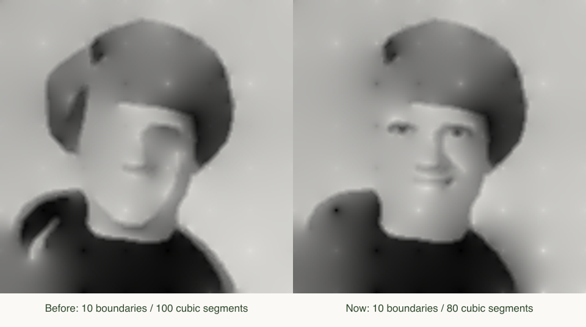

# The moment of recognition

This local iteration gives the construction a specific activity: decide when enough information has arrived, reveal the source, and then find what can still be removed. It makes no claim that the player's recognition or the drawing's beauty has been objectively measured.

## Round rules

- The source image and filename are hidden before the round ends. The default NASA crop is a demonstration, not a new randomized puzzle on every replay. For an unknown familiar subject, another person should choose the photograph.
- A round starts from the 64 tone anchors with zero boundary curves. It advances by one boundary after the current frame has been computed and displayed. Automatic mode waits 700 ms between accepted frames; manual mode uses the same transition.
- Stop freezes the accepted frame, even if a later one is already computing. Delayed frames from an old round are rejected by a round epoch. The result cannot silently advance after the player stops.
- Exhausting all boundaries reveals the original and records a different finish reason from a player's stop.
- After reveal, the player can remove or add boundaries in the same ordering and return to their original stopping point. This is not arbitrary single-line deletion; the construction editor still supports deleting a selected boundary.
- The exported card depicts the currently displayed reconstruction. Its caption counts boundary chains and cubic pieces, and acknowledges 64 tone anchors. A JSON recipe can be imported into the construction editor without the source.

## A more useful early ordering

The construction engine's original ordering remains unchanged for the editor and older recipes. The game applies `compact-center-v1` after extraction:

```
focus = 1 + 4 exp(-((cx - .5)² + (cy - .48)²) / .065)
priority = original_score × focus / (sqrt(source_chain_length) × (1 + .1 × cubic_piece_count))
```

The center is the mean of segment endpoints in normalized image coordinates. This favors compact detail near the center and reduces the dominance of very long boundaries. It does **not** detect anatomical parts, guarantee facial recognition, or minimize reconstruction error. Off-center faces and full-body images can be disadvantaged by its center bias.



On the bundled close portrait, the first ten boundaries expose eye and mouth detail earlier while using 80 cubic pieces instead of 100 (1,312 vs 1,592 counted geometry/tone scalars). This is a visual observation on one example, not a measured recognition improvement. It is not an equal-parameter-budget comparison.

The tradeoff is explicit: whole-image luminance RMSE becomes **worse**, from 0.08791 to 0.12454. RMSE in a fixed central 80 × 80 square also rises, from 0.10293 to 0.11610. Hair, clothing and broad tone receive less of the early budget. See [recorded results](reveal-validation.json). The new order is selected for this reveal experiment, not presented as a universal numerical improvement.

All original curves, control points, tone samples and anchors are preserved; only their order changes. With all curves retained, accumulated floating-point summation can differ by a tiny amount, tested within one output-channel level.

## Validation and remaining uncertainty

Automated checks cover frame acceptance, stopping during a pending solve, replay isolation, manual/automatic progression, exhaustion, trimming and restoration, empty input, deterministic ordering, and full-construction preservation. A Node worker wrapper runs the actual browser-worker module to check the construct/render/error message paths and transferable pixel array. Compilation and static export check all three routes.

No browser interaction QA or user playtest has been performed in this iteration. In particular, perceived fun, button discoverability on different devices, and whether the revised ordering improves recognition across different people remain questions for actual play. The optional WebMCP tools have not been verified in a supporting browser context.
