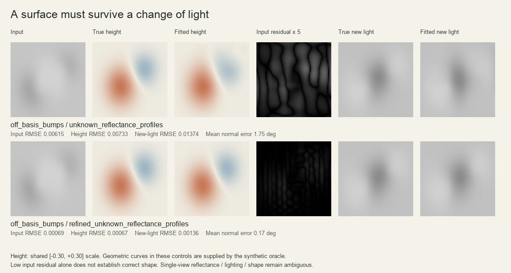
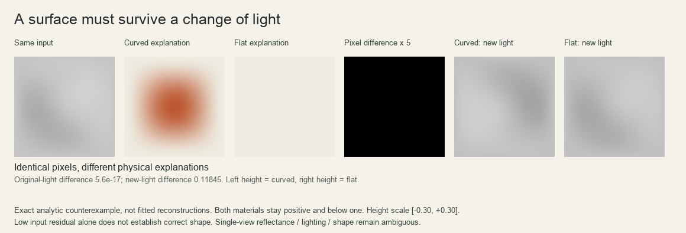

# 连续曲面实验：让构造接受光照检验

这是独立的算法研究原型，尚未接入网页。目标是让曲线、曲面法向与明暗由同一套连续函数生成。只依赖 NumPy 和 Pillow；无生成式 AI、预训练模型或隐含底图。已有二维曲线编辑器保持原样。

## 本轮问题与预先声明的预测

关键问题：低维连续曲面是否能在明确的成像假设和额外几何观测下，恢复可以接受**新光照检验**的形状？哪些条件移除后，图像拟合不能再支持形状解释？

运行 `study.py` 前声明：

1. 已知光照、均匀反射率和边界高度时，平滑圆顶与鞍面的拟合应该在未参与求解的采样点及新光照下成立。圆顶不在有限三次样条空间内，鞍面在；另外保留高斯双峰作为空间外的迁移测试。
2. 允许反射率变化会增加形状歧义。加入两条**外部提供的真实深度截线**预计降低形状和新光照误差；这是额外观测的作用，不能宣传成自动图像分析的成功。不保证每种形状都有改善，保留反例。
3. 已知平面上的色块应由已知反射率解释，不应凭颜色产生深度。未知色块仍可能混淆。
4. 曲面加均匀材料，与平面加特制材料，可以生成逐像素相同的输入。任何只看该输入的确定性算法都会给出同一结果，因此至少对其中一种真值判断错误。这是模型边界，不是优化器故障。

不以输入误差单独判定成功；记录独立采样的高度 RMSE、法向夹角、新光照 RMSE、反射率误差、停止原因和每次接受步骤的目标值。所有案例共享设置，不逐案例调参。

## 数学构造

正交相机下，定义区域 `(x,y) ∈ [-1,1]²`：

```text
z(x,y) = Σ c_ij B_i(x) B_j(y)                 8×8 三次 B 样条
a(x,y) = Σ a_ij A_i(x) A_j(y)                 4×4 三次 B 样条
ρ(x,y) = exp(a(x,y))                          正的有效反射率
n = (-z_x, -z_y, 1) / sqrt(1 + z_x² + z_y²)
I_hat = ρ [ambient + max(n·l, 0)]
```

固定输入的单位光照向量 `l`；本版本不声称同时识别未知光照。`ρ` 包含未知曝光尺度，未限制到 `[0,1]`，不是校准过的绝对物理反射率。

所有法向来自同一标量曲面，混合偏导一致，可积性由表示保证。投影曲线 `C(t)=(x(t),y(t))` 提升为 `(x(t),y(t),z(C(t)))`，切线高度导数为 `z_x x′ + z_y y′`。两条曲线投影在同一点时共享高度；这也是单高度场无法表达遮挡重叠的限制。

外部曲线观测支持两种语义：`z(C)=h` 的高度截线，以及 `∇z(C)·m=g` 的横向斜率约束。普通亮度边界不能自动赋予这两种含义；零横向斜率本身也不能证明一条曲线是解剖学脊线。

目标函数（离散均匀求积）为：

```text
mean[(log I_hat − log I)²]
 + λ_b mean[z_xx² + 2z_xy² + z_yy²]
 + λ_s mean[z_x² + z_y²]
 + λ_a mean[a_x² + a_y²]
 + λ_c Σ_curve mean[(G_curve c − observed)²]
```

没有绝对高度观测时，额外约束平均高度为零，仅固定高度平移自由度。薄板弯曲能偏好平滑形体，材料平滑能偏好缓变材料；二者都是设计者的先验，可能把真实色块误解为形状。约束在每条曲线内按样本数归一化。曲面和材料先验使用固定均匀求积点，与输入像素掩膜分开。

求解采用解析导数的阻尼 Gauss–Newton，只接受目标值下降的步骤。阴影分支对形状的导数为零；全局最优和唯一解均无保证。停止记录区分梯度小、目标变化小、找不到下降步、迭代上限；“目标变化小”不等同于形状正确。

## 复现

Python 3.11+：

```sh
cd research/surface
python -m pip install -r requirements.txt
python -m unittest discover -v
python study.py
```

`results/validation.json` 保存完整数值，`surface-study.png` 用统一高度色标展示原图、真实高度、估计高度、输入残差与换光照结果。`example-surface.json` 不保存输入栅格，包含连续曲面、材料系数、光照、外部曲线观测与优化历史。可以在新采样点直接求值；更密的输出不代表增加了原图没有的细节。

对自己的图片运行诊断（给定的光照仅是待检验假设；默认中心正方形裁切）：

```sh
python fit.py --input ../../public/portrait.png --output ../../outputs/surface \
  --light 0.5 -0.35 1
```

输出连续模型 `model.json`、重建图 `reconstruction.png`、换光照图、材料图、法向图、高度假设图及中文 `explanation.md`。照片先按名义 sRGB 转换为线性亮度，排除接近黑色或饱和的观测；输出记录裁切、排除像素、假设、误差、停止原因与显示裁切比例。它是研究诊断，不是已完成的肖像绘画模式。

`principal_geometry` 使用曲面的第一、第二基本形式解广义特征值问题，计算真实的主曲率和方向；不会把二维 Hessian 的特征值当作曲面曲率。在两主曲率相等的位置，主方向没有唯一意义，函数明确标记方向未定义。该方向有效性只涉及当前曲面上的数学定义，不代表恢复形体的可信度。

## 已得到的结果（2026-09-06）

训练采用 41×41 网格，数值评估采用 73×73 网格（包含部分重合点，但没有用于拟合的新增采样）；新光照完全没有用于求解。低亮度残差不是形状证据的充分条件。

| 形状与已提供信息 | 曲面系数 | 高度 RMSE | 新光照 RMSE | 平均法向误差 |
| --- | ---: | ---: | ---: | ---: |
| 圆顶，已知材料、边界高度 | 64 | 0.000288 | 0.000613 | 0.112° |
| 鞍面，已知材料、边界高度 | 64 | 0.000298 | 0.000447 | 0.068° |
| 双峰，未知材料、边界高度 | 64 | 0.005132 | 0.012809 | 1.465° |
| 双峰，再加真实深度截线 | 64 | 0.007329 | 0.013740 | 1.747° |
| 双峰，同样截线、细化曲面 | 169 | 0.000673 | 0.001362 | 见 JSON |

圆顶和鞍面的截线约束改善了本次恢复，但**双峰案例出现反例**：64 个系数不足以同时表达明暗与截线，新增信息让全局误差变差。看到失败后，进行了一项明确的后续诊断：将样条每个结点区间二分，系数从 8×8 变成 13×13，其他权重不变；高度误差降低约 91%。这是针对失败的容量诊断，尚不是自动选模型算法，也不是在新样本上验证过的普遍改进。保留细化前结果，不覆盖失败记录。



另外，构造出的“均匀材料圆顶”和“带渐变材料的平面”，原光照下的最大像素差约 `5.6e-17`，材料值均在 `(0,1)` 内，却有明显不同的真实高度与换光照结果。不能通过提高像素精度消除这种歧义。



公开 NASA 人像也做了诊断：80 个曲面与材料系数、没有几何曲线，给定光照假设下有效像素亮度 RMSE 为 **0.11955**，高度跨越 **−2.00 到 1.54**，而图像域宽度仅为 2。这已明显偏离想要的浅浮雕解释，不能把它当作正确的人脸曲面。记录在 `results/portrait-diagnostic.json`；样例来源与授权见项目 [CREDITS](../../CREDITS.md)。合成场景成功尚未转化成真人上的成功。

数值测试覆盖解析导数、可积曲面、光度雅可比、阴影分支、换光照、曲线提升与相交一致性、外部横向斜率、已知材料边界、浅浮雕歧义、主曲率度量及 JSON 重放。

## 适用范围与已有工作

当前只验证无噪声、无投射阴影、无高光的浅浮雕合成场景。单张真实人像还涉及遮挡、透视、头发、皮肤散射、未知光照与材料边界。本实验不恢复真实人体，不自动识别器官，也不宣称“完美数学构造”。下一步要解决的是如何取得有来源、有置信度的几何约束及材料分区，并对不能确定的区域保留多个解释。

- Barron & Malik, *Shape, Illumination, and Reflectance from Shading*: 用形状、反射率与光照先验联合解释图像是已有研究方向，本项目不宣称发明该思想。[作者机构技术报告](https://www2.eecs.berkeley.edu/Pubs/TechRpts/2013/EECS-2013-117.pdf)
- Belhumeur, Kriegman & Yuille, *The Bas-Relief Ambiguity* (1999): 特定 Lambertian 假设下，广义浅浮雕变换与相应光照、材料变换可以保持图像不变。单靠可积性不能消除这种歧义；测试另以零环境光精确验证一个变换实例。[论文](https://www.cs.jhu.edu/~ayuille1/PubsJournal/J52BelhumeurKriegmanYuille99.pdf)
